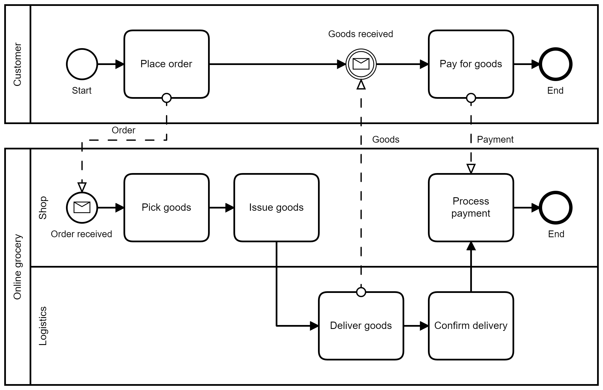

# Business Process with Constraint

This is a repository containing business processes with constraints.

## Background

A business process is a set of activities executed in sequence to achieve a business goal. To achieve business goals, business processes need to comply with business regulations, satisfying functional and non-functional constraints. Functional constraints are constraints on the execution order between activities. Non-functional constraints are constraints on KPIs like time, cost, profit, and customer satisfaction, to ensure business performance.

## Repository

In the `repository` directory, each sub-directory holds a business process and its constraints. The business process is stored in `business-process.bpmn`. Since different sets of constraints can be specified in different scenarios, the set of constraints in each scenario is stored in `scenairo-x.md`.

For example, `online-grocery` holds the business process of an online grocery and its constraints. `business-process.bpmn` contains the business process. When a customer places an order, the online grocery will deliver goods to the customer and receive payment from the customer:

`scenario-1.md` contains the set of functional and non-functional constraints in one scenario:

In the `Introduction` section, the scenario is described.

In the `Functional Constraint` section, the execution orders between activities are described.

In the `Non-functional Constraint` section, the constraints on KPIs are described. In the `KPI` sub-section, the calculation formulas of KPIs are defined. In the `Valuation` sub-section, activities' valuations on variables are described. There are three types of valuations, including `determinate`, `controllable`, and `uncontrollable`. `determinate` means that the value is a determinate value. `controllable` means that the process controller can control the value. `uncontrollable` means that the value depends on the environment. The business process satisfies non-functional constraints, if the process controller can control the controllable variables to keep KPIs within ranges, regardless of uncontrollable variables.

## Source of Business Process

We have incorporated the business processes from RePROSitory (https://pros.unicam.it:4200/index). We are classifying these business processes into categories. The `category` directory holds the classified business processes. The `unclassified` directory holds the business processes yet to be classified.

## Call for Contribution

We would appreciate it if you could contribute more business processes, or contribute more constraints of existing business processes. You can use `online-grocery` as a template. You can contribute through pull requests.

## License

This repository is licensed under Creative Commons Attribution 4.0 International.
