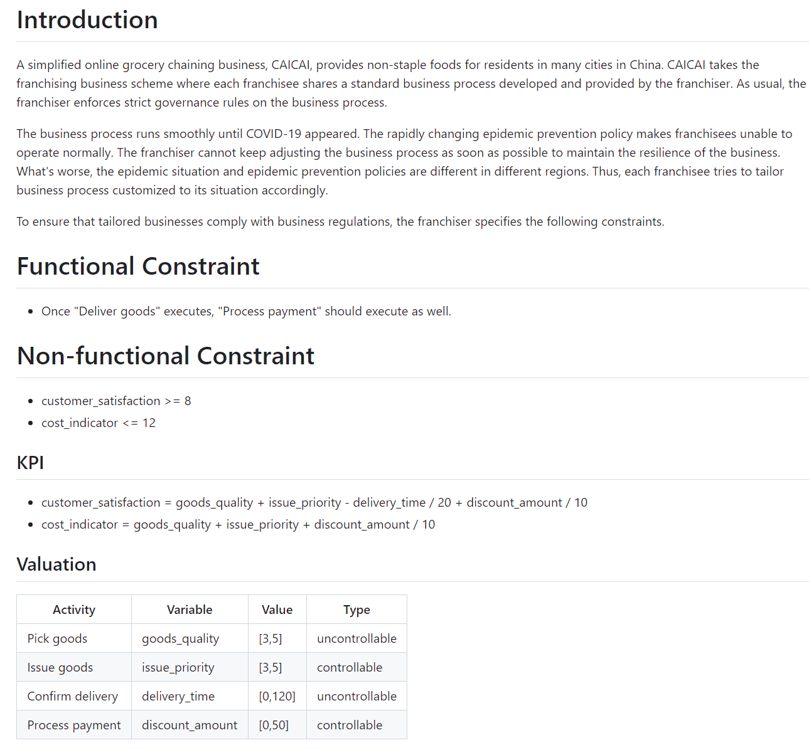

# Business Process with Constraint

This is a repository containing business processes with constraits.

## Background

A business process is a set of activities executed in sequence to achieve a business goal. To achieve business goals, business processes need to comply with business regulations, satisfying functional and non-functional constraints. Functional constraints are constraints on the execution order between activities. Non-functional constraints are constraints on KPIs like time, cost, profit, and customer satisfaction, to ensure business performance.

## Repository

In the `repository` dierctory, there are business process files in `.bpmn` format. Each business process has a constraint file in `.md` format, with the same name.

For example, `online-grocery.bpmn` is the business process of an online grocery. When a customer places an order, the online grocery will deliver goods to the customer and receive payment from the customer:

`online-grocery.md` contains functional and non-functional constraints of the business process. Customer satisfaction and cost are concerned:

In the `Functional Constraint` section, the execution orders between activities are described.

In the `Non-functional Constraint` section, the constraints on KPIs are described. In the `KPI` section, the calculation formulas of KPIs are defined. In the `Valuation` section, activities' valuations on variables are described. There are three types of valuations, including `determinate`, `controllable`, and `uncontrollable`. `determinate` means that the value is a determinate value. `controllable` means that the process controller can control the value. `uncontrollable` means that the value depends on the environment. The business process satisfies non-functional constraints, if the process controller can control the controllable variables to keep KPIs within ranges, regardless of uncontrollable variables.

## Call for Contribution

We would appreciate it if you could contribute more business processes with constraints, or contribute more constraints of existing business processes. You can use `online-grocery.bpmn` and `online-grocery.md` as templates. You can contribute through pull requests.

## License

This repository is licensed under Creative Commons Attribution 4.0 International.
